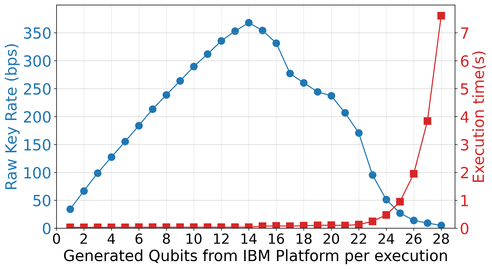
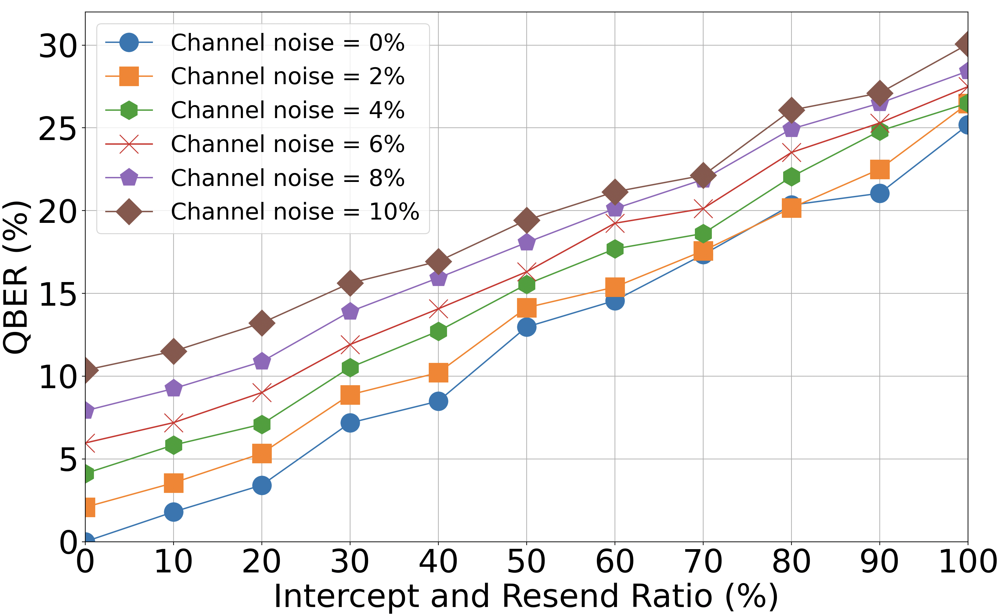
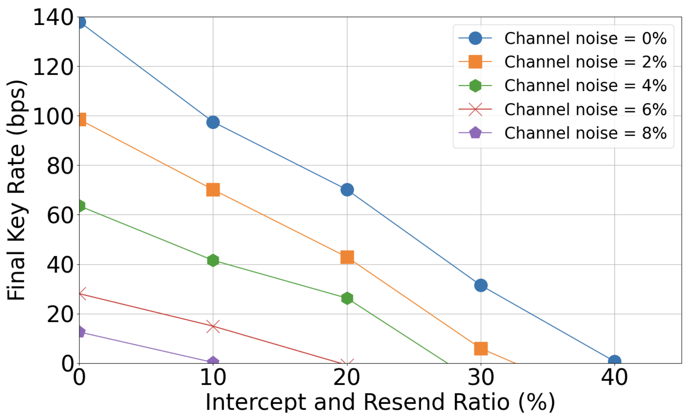
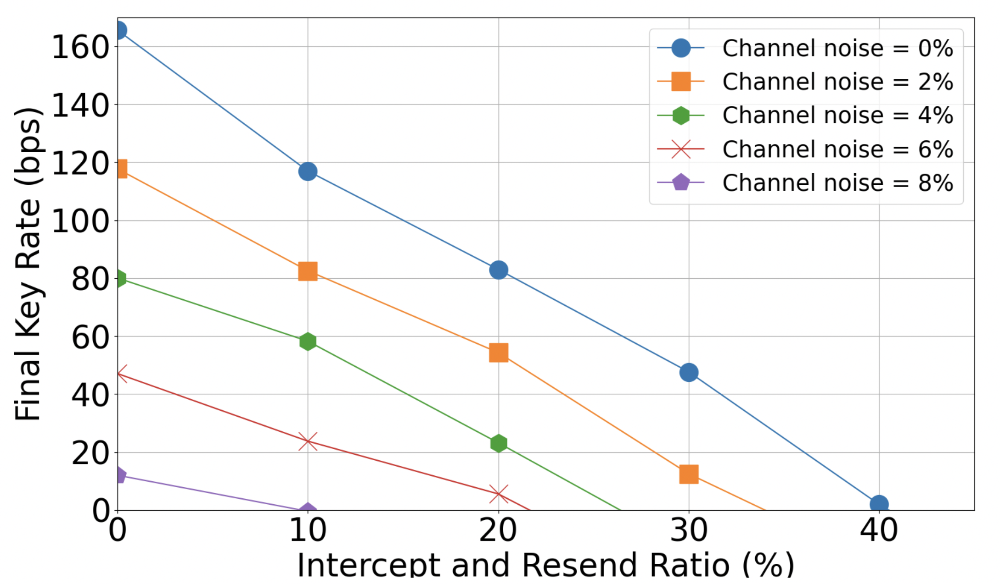

# Chat Application Based on Quantum Key Distribution

## Quantum Key Distribution (QKD) : Introduction
* QKD is a promising method to distribute secure keys secretly between legitimate users 
    * It bases on the laws of quantum physics
    * First QKD protocol proposed by C. Bennett and G. Brassard in 1984, i.e., *BB84 Protocol*
    * Some of best-known Japanese companies have been working on various QKD projects, 
    e.g., Toshiba, NEC, and NTT 
    * Two legitimate users can share the secret keys over the quantum channel
    * They use the classical channel (for example: Internet) for authentication (for example, key reconciliation)

        

## Quantum Key Distribution (QKD) : BB84
* BB84 is a quantum key distribution scheme developed by Charles Bennett and Gilles Brassard in 1984. 
    * BB84 uses photon polarization states to encode the bits of the key
    * Each bit is encoded with a random polarization 2 basis
    * Example of BB84 
        * Alice selects random bits and basis to decide qubit state. Bob selects random basis to derive the his bit. If the basis chosen is different between Alice and Bob respectively, the bit values are discarded.
    


## Qiskit
* Qiskit is It is an open-source SDK for quantum computing and supports the development and simulation of an application. Leveraging the libraries available in Qiskit to create quantum circuits that execute on a quantum simulator from a classical development environment such as Python makes integration seamless and straightforward. 
    

* *Check official site* : <https://www.ibm.com/quantum/qiskit>
* *Check the document* : <https://docs.quantum.ibm.com/>


## Development of Secure chat application based on QKD (using **Qiskit**)
* Develop secure chat application based on QKD
    * **The BB84 protocol**  can be applied for sharing secret keys between two legitimate users
    * Qiskit is a python library by IBM helps develop application using QKD
        * Generate *Qubit*(the basic unit information for quantum computing)
        * Generate secret keys using Qubit according to the BB84 protocol.
        * *Check the document* : <https://docs.quantum.ibm.com/>

## Framework of QKD Simulator Based IBM Quantum Experience
* IBM provides some quantum simulators from **IBM Quantum Experience(IQX)**.
    * Alice and Bob use the Quantum Channel Simulator on the IBM platform and Classical channel for BB84 protocol
    * Quantum Channel Simulator is used for processes related to Qubit (decide and measure Qubit)
    


## IBM Quantum Experience
* IBM Quantum Experience (IQX) offers quantum simulators that allow experiments to run locally, serving as practical alternatives to real quantum computers, which are often in high demand. These simulators are particularly valuable for developing QKD-based applications, enabling detailed testing of quantum circuits under varied conditions. Specifically, noise errors in the quantum channel environment—critical in QKD—can be accurately simulated, allowing researchers to optimize protocols and ensure system robustness before deploying on actual quantum hardware.


## Flowchart of QKD protocol (BB84)
* Steps to share a shared key (secret key) between Alice and Bob.


## Flowchart of chat application based on QKD
* Simple steps for communication between Alice and Bob.


<br><br>

# Report of simulation
## Raw key rate 
* The raw key rate refers to the number of qubits provided per second by IQX.
* We specified the qubits (1 ~ 28 qubits) that could be generated from the IQX in a single run, and ran the simulation under these conditions to investigate the raw key rate.

### Result


* The highest raw key rate was found to be achieved with 14 qubits.

&rArr; Required key length can be generated in the shortest possible time.

## Quantum Bit Error Rate (QBER)
* QBER refers to the ratio of bit errors between Alice and Bob in the sifted key.
* That is caused by a change in the state of the photon due to an **intercept and resend attack (IRA)** by an eavesdropper or noise on the quantum channel.
* We have considered quantum bit eavesdropping and noise on the quantum channel due to third-party intercept and resend attacks. 

### Result


* Increases with higher IRA ratios and channel noise frequencies, reflecting more bit errors in the sifted key between Alice and Bob. 
* In an ideal BB84 QKD protocol without channel noise (0%), Alice and Bob measure a QBER of 25% under 100% eavesdropping.  &rArr; Same as theoretical rate.

## Final key rate
* Final Key Rate refers to the rate of generation of the number of bits (bps: bits per second) that can be used as the final secure key in QKD.
* We used the formula based on the reference[1] to determine the Final key rate. 
    * [1]: G. Bebrov, “On the (relation between) efficiency and secret key rate of qkd,” Scientific Reports, vol. 14, p. Article number: 3638, 2024

```math
\mathit{R} = c \times s \times p [H(A|E) - \textit{f}H(A|B)]
```    

### Parameters
* The $\textit{c}$ is the raw key rate, so based on the simulation about raw key rate, the value is decided.
* The sifting coefficient $\textit{s}$ represents the fraction of raw key bits retained after Alice and Bob match their measurement basis. In BB84, Alice and Bob each choose one of two bases. Therefore, their bases match with a probability of 0.5, so s is usually 0.5.
* The coefficient $\textit{p}$ represents the parameter estimation coefficient, which accounts for the fraction of the sifted key used to estimate the QBER. Typically, $\textit{p}$ ranges between 0.75 and 0.9. A higher value (e.g., 0.9) indicates that a　smaller proportion of the sifted key is allocated for parameter estimation, leaving more　bits for the final key. However, this reduces the accuracy of error estimation. 


### Notations
* $H(A|E)$ denotes the amount of information that Eve is uncertain about Alice’s key after the sifting step.
* $H(A|B)$ denotes the theoretical amount of information that Alice and Bob need to exchange for KR, which is also the information leaked to Eve during the KR step. 
* $\textit{f }$ is the efficiency of the error correction algorithm. 

### Remarks
* In the case of BB84, $H(A|E) = 1 - \textit{h}(QBER)$ and $H(A|B) = \textit{h}(QBER)$, where $\textit{h}$ is the binary entropy function.


### Result
* In case of $\textit{p} = 0.75$


* In case of $\textit{p} = 0.9$


* The Final key rate falls as the Intercept and resend ratio and noise channel levels increase.
* A relatively higher final key rate was achieved for p = 0.9. In this case, the Final key rate reached 160 bps.


## Conclusion
Designed in Qiskit through IBM Quantum Experience (IQX), QKD was simulated using quantum circuits to achieve a realistic implementation. Simulations of Raw Key Rate revealed the optimum number of qubits for key generation. Furthermore, simulations of QBER and Final Key Rate showed that QBER reached approximately 25\% at 0\% channel noise and 100\% IRA ratio, aligning closely with the expected theoretical value for BB84. The Final Key Rate exhibited a declining trend as channel noise and IRA ratio increased, demonstrating the impact of these factors on key generation efficiency. These findings confirm the reliability of Qryptic Chat and highlight its potential for further refinement and practical deployment.
